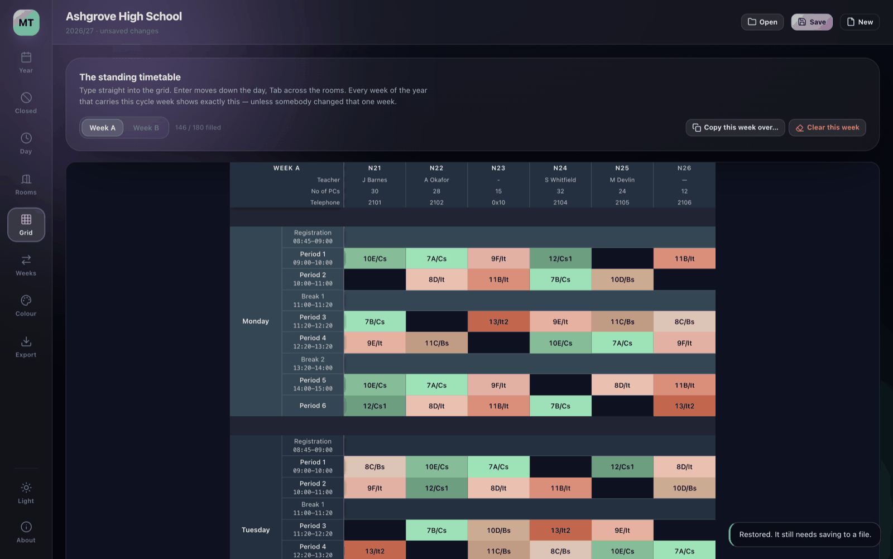
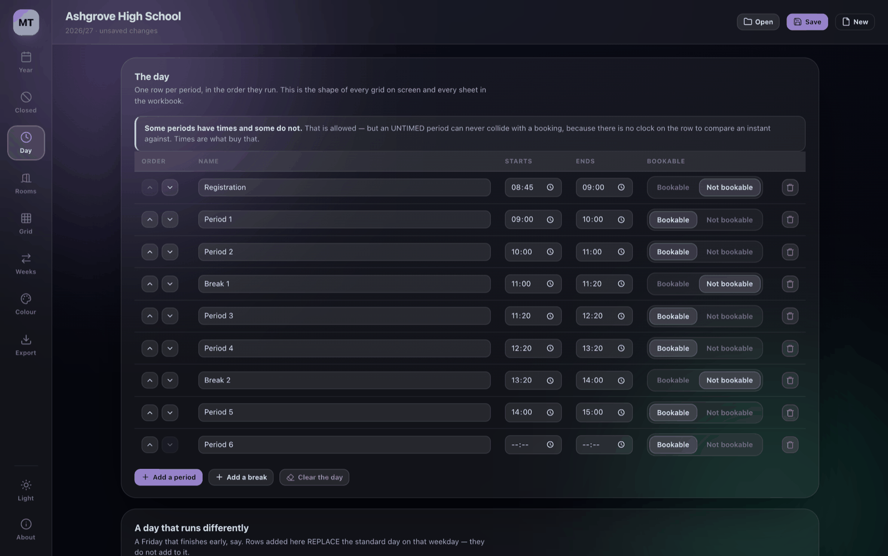
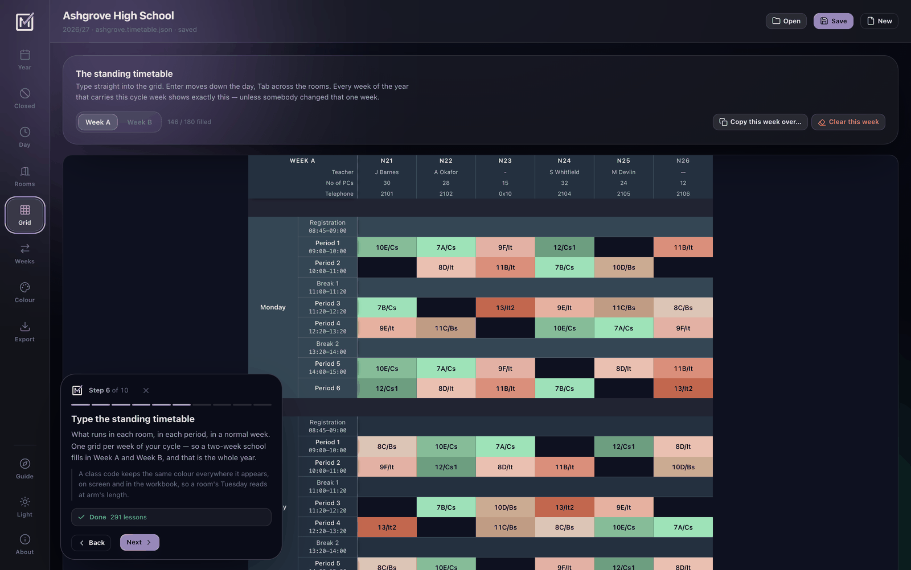
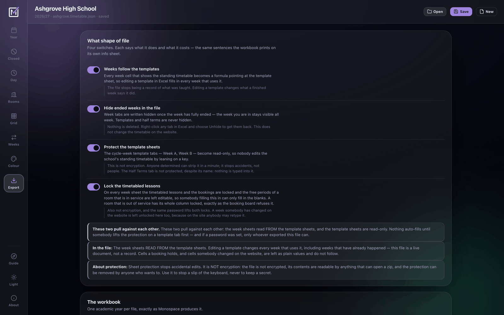
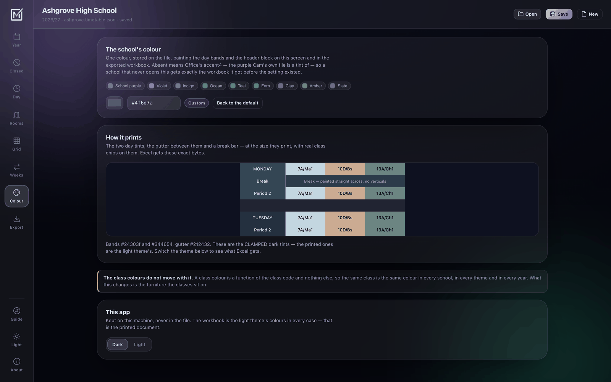
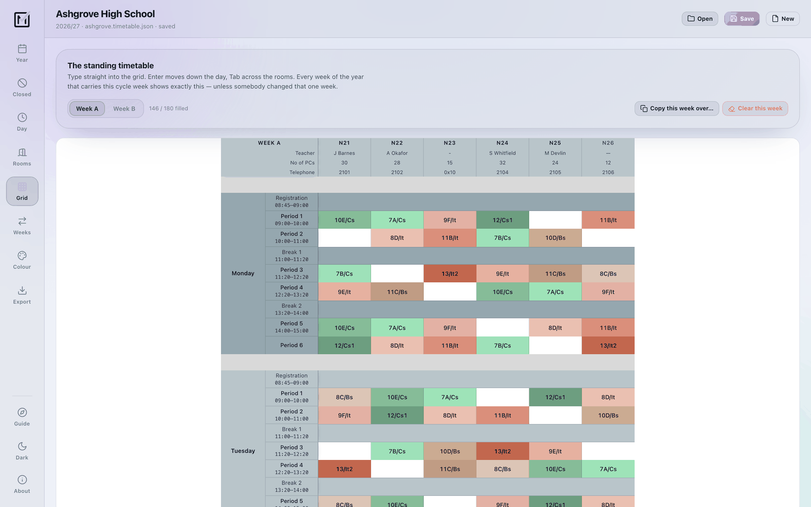
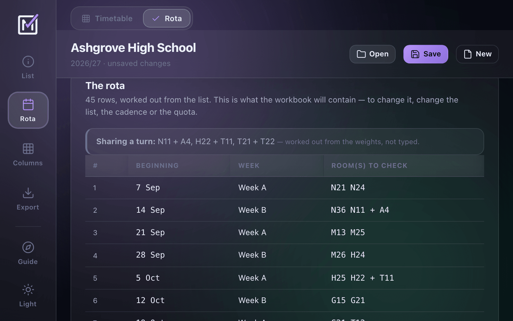
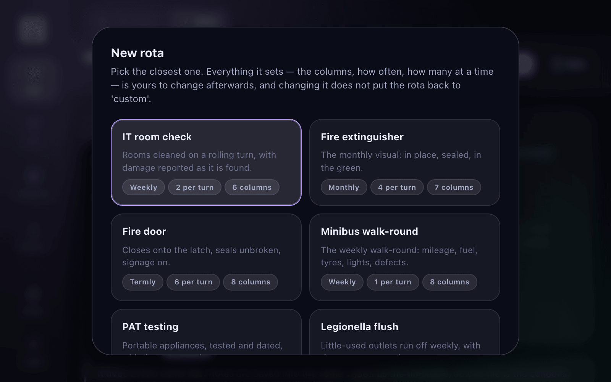
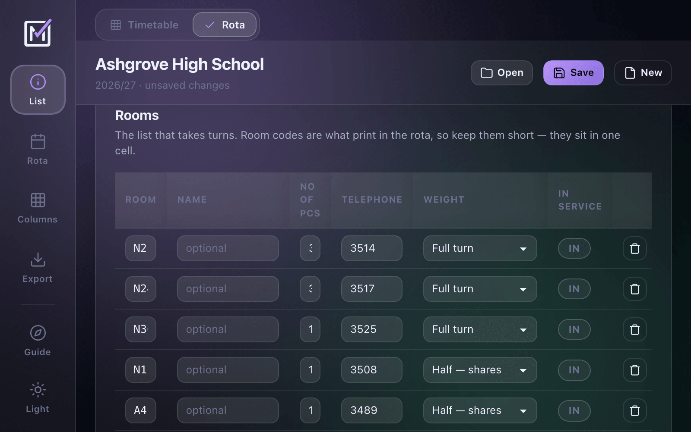
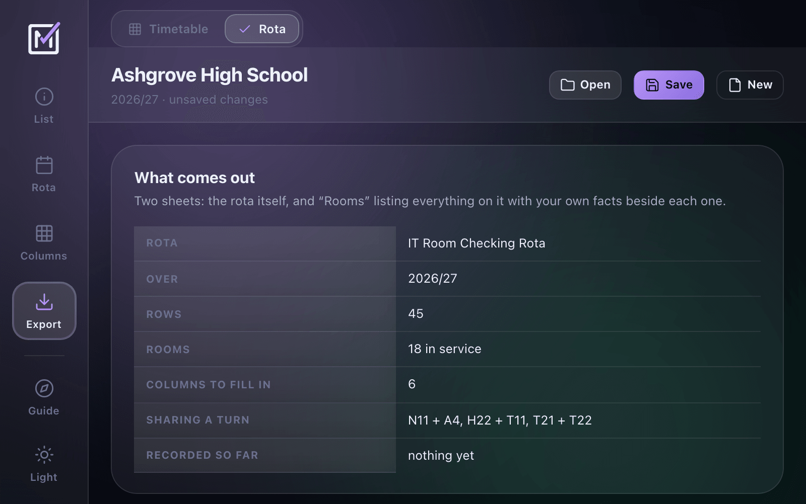

# Monospace Timetable

Two jobs every school does on a spreadsheet, done properly and given away.

**Timetable** — your standing room timetable, as an Excel workbook with one sheet per week.
**Rota** — the recurring checks that run alongside it: IT rooms cleaned, extinguishers
inspected, fire doors, minibuses, PAT testing.

Free, no account, no upload. Your work stays on your computer.

---

## Get it

**[Download the latest release →](https://github.com/camwooloo/Monospace-Timetable/releases/latest)**

| | |
|---|---|
| **`timetable.html`** | One file. Double-click it. Works in any browser, on any computer — Windows, Mac, Chromebook — with nothing installed and no admin rights. |
| **`timetable.exe`** | Portable Windows app. No installer, nothing left in your registry, runs from a USB stick or a network share. Updates itself. |

Both are built from the same code in the same job, so they behave identically.

> **Windows will warn you about the `.exe`.** It says *"Windows protected your PC"* because the file
> isn't code-signed — a certificate costs a few hundred pounds a year and this is free. Click
> **More info → Run anyway**. If your school blocks it, use `timetable.html` instead; it needs no
> permission from anyone.

---

## What you do

Fill in five things down the left-hand side, in order:

- **Year** — first day, last day, and whether you run a one, two or three week cycle
- **Closed** — holidays, INSET days, bank holidays
- **Day** — your periods, breaks and times
- **Rooms** — the room codes, and any columns you want printed under them
- **Grid** — type the standing timetable straight in

Then **Export**, and you have the workbook.

---

## Never done this before?

**The app will walk you through it.** Ten steps with Next and Back, and each one
takes you to the screen it is talking about and points at the control you need —
so you are doing it as you read it, rather than reading first and doing it after.

Each step also tells you whether that part is finished, and says plainly which
three are optional — closures, one-off week changes and the colour are all things
you can export a perfectly good workbook without.

It offers itself the first time you open the app. After that it is in the left
rail under **Guide**, so it is there again in August when somebody new picks this
up.

---

## What you get

One sheet per week for the whole year, plus your templates and a half-term overview.

- Colour-coded sheet tabs, so you can see at a glance which week is which
- A colour per class code — the same class is the same colour everywhere
- Alternating day blocks and break rows, so a week reads at arm's length
- Custom columns under each room — *No of PCs*, *Teacher*, *Telephone*, whatever you need

Four optional switches, each of which tells you plainly what it does **and what it costs**:

- **Weeks follow the templates** — edit a template in Excel and every week using it fills in
- **Hide ended weeks** — finished weeks are hidden, never deleted
- **Protect the templates** — the standing timetable becomes read-only
- **Lock the timetabled lessons** — staff can fill in free periods and nothing else

And you can set the colour the workbook is built around:

Light theme too, if you prefer:

---

## The other tab: Rota

A rota is a list of things and a rule for taking turns. Two rooms cleaned a week.
Four extinguishers a month. A minibus walked round every Friday.

Give it the list, say how often and how many at a time, and it produces the whole
year — then exports it as a formatted spreadsheet.

**Start from a preset.** Eight ship, each with the columns that check actually needs:
IT room check, fire extinguisher, fire door, minibus walk-round, PAT testing,
legionella flush, fridge temperature, and a blank one to build your own.

A preset is a starting point, not a mode — change any of it afterwards and nothing
puts it back.

**Half turns, paired automatically.** Mark a small room as taking half a turn and the
rota puts two of them in one slot. The line printed under the title — *N11 + A4,
H22 + T11, T21 + T22* — is worked out from the rota underneath it rather than typed,
so the two cannot drift apart. That is the column most schools maintain by hand.

**It follows your school year.** Week letters and holidays come from the same calendar
the timetable prints, so *Week A* and *Half Term* mean the same thing on both sheets.
A school with no timetable in the file can give a rota its own start and end dates
instead — you can run a fire-door rota and never touch the timetable half.

**Then print it.** The workbook is two sheets: the rota itself, and everything on it with
your own columns beside each row — *No of PCs*, *Telephone*, whatever you keep.

There are two export buttons, and in this tool they usually produce the same file.
**It builds the sheet; it does not tick it off** — you print it and fill it in, which is
what a clipboard rota is for. *With data* earns its keep when a rota has come **from**
Monospace carrying checks somebody already recorded there; then it prints them, and
*blank template* leaves the tick columns empty so you can carry a fresh one round.

---

## Your file

**Save** writes a `.json` file wherever you choose — put it on a shared drive and anyone can open it.
The browser keeps a courtesy copy so a closed tab doesn't lose your afternoon, but that copy is not a
save and the app says so.

Nothing is uploaded. There is no server. Turn off the internet and it still works.

Timetables and rotas live in the same file here, so one `.json` holds both.

**And that same file opens in [Monospace](https://www.monospace.page), both ways** — but the two
halves travel by different doors, so it is worth knowing which is which.

**The timetable** goes through Monospace's Organisation → Timetable. Pull a year out as a
`.timetable.json`, open it here and build the workbook — or do the whole timetable here first and
load it into Monospace without typing any of it twice. The dates, the cycle, the closures, the day,
the rooms and the whole standing timetable come across. Bookings don't, and Monospace tells you what
it could not bring over before it imports anything.

**A rota** goes through the Rota section of whichever project owns it, one rota per import, because
a rota belongs to a department rather than to the school. That file carries the list, the weights,
the columns, the wording and any checks already recorded — plus the academic year it follows, so the
week letters and holiday names come out the same on both sides.

Loading a timetable file will not bring your rotas in with it, and importing a rota will not create
an academic year. Each says so at the time.

---

## This is one feature of something bigger

Monospace Timetable is a slice of **[Monospace](https://www.monospace.page)** — an all-in-one project
management app that happens to be very well suited to schools.

A school runs on departments, and Monospace is built that way: **IT Support**, **Site Team**,
**Finance** and the rest each get their own space, with the boards, tasks, notes, pages, chat and
tickets that department actually needs, and nothing it doesn't.

Around them sit the things that belong to the whole school rather than one department:

- **Timetable & Booking** — this generator, plus a live booking board for rooms and minibuses that
  every department books against, so two departments can't take the same minibus on the same Tuesday
- **Inventory** — sites, buildings, rooms and every asset in them, with warranties, licences,
  suppliers and depreciation. The thing Civica Parago does, without the price
- **Helpdesk** — staff raise tickets, your team works them
- **Pages** — the internal reference pages a school accumulates: printers, servers, who to ring

If the timetable generator is useful to you, the rest probably is too.
**[Have a look →](https://www.monospace.page)**

---

## Questions and problems

Open an issue. Genuinely, please do — a bug report from a real school is worth more than any amount
of testing here.

**No SLA, no support email.** This is free and maintained by one person who also has a day job. Issues
are read and acted on when there's time; September is a busy month for everyone.

## Licence

[AGPL-3.0](LICENSE). Free to use, free to change, free to share. See [LICENSING.md](LICENSING.md).
